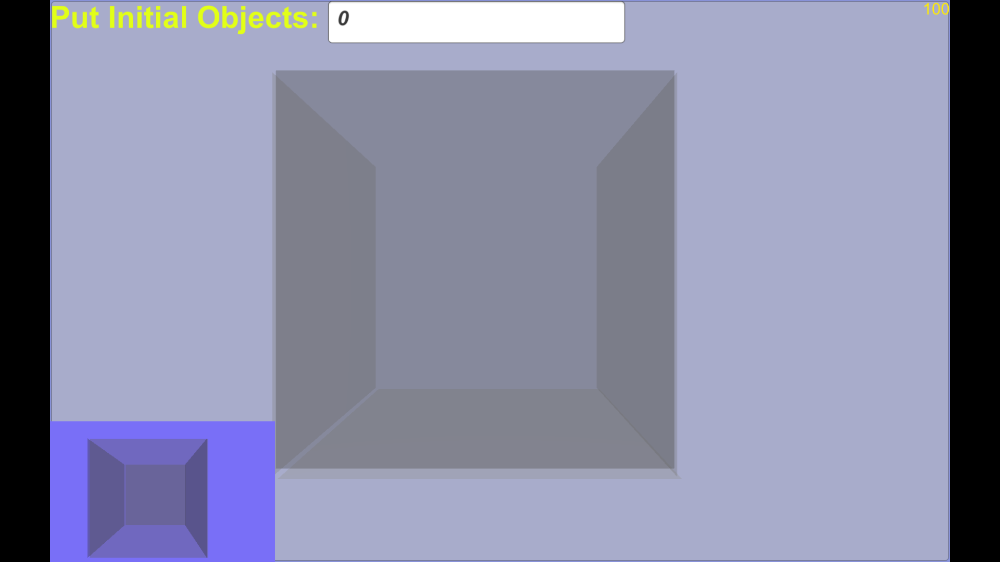
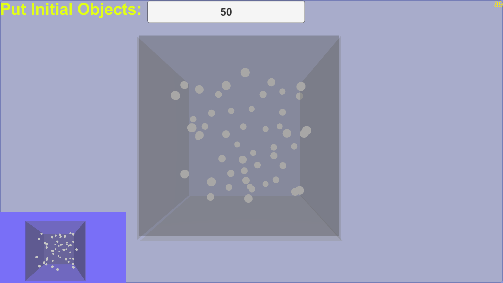

Ball Collider Game made in Unity
====

## Images

<p float="left">
  
   
  
</p>

## Prerequisite

Unity 5.6.6 is required to modify the game. To run the simulation ,any computer with a working browser can be used.


## HOW TO OPERATE THE SOLUTION

There are two methods to access the solution:

1. Go to the ``` Ready_To_Look_Solutions/Build ``` folder, you can check three solutions for different OS. WebGL works for any browser enabled system and to use that just open the HTML file in the WebGL folder. You can input the number of objects you want at the top panel

Timer is set to 100 Seconds, to really change it, You will have to import the Unity_Package.

2. Import the package in Unity Editor and check the scripts:
	* I have attached 5 scripts in total and they are pretty much explainable with the name and commenting.Hit the play button to run and specify the objects in the box.
	* To record the object movements at custom location, open the LogFiles Script and specify the path you want.
	* It is necessary to mention that the path originally provided in ready made solution might not exist due to system write permissions. Hence to really get all the logs modify the path in the code [here](https://docs.unity3d.com/ScriptReference/Application-persistentDataPath.html).
	* one can modify the timer by selecting gamemanager object and then in the inspector tab(rightmost generally) look for the Timer script and put your favourite number.
	
## Loggging

Sphere collisions are logged in ``` ~/local/temp ``` folder as 3D-Coordinates. 
